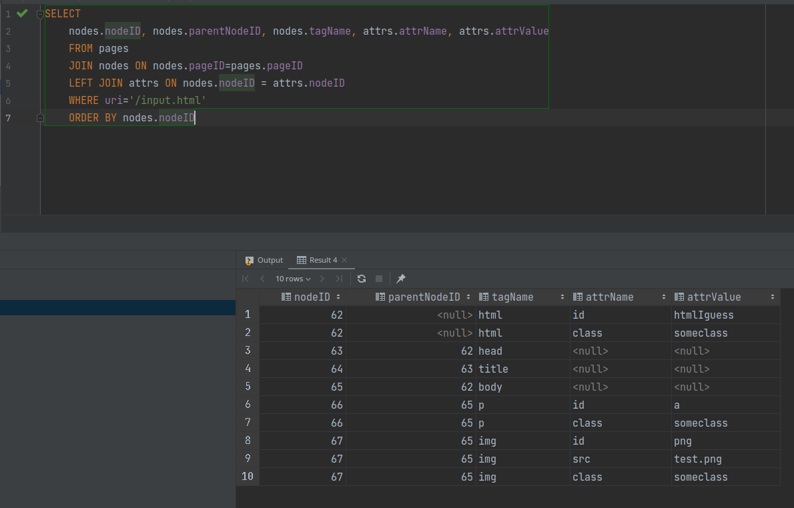
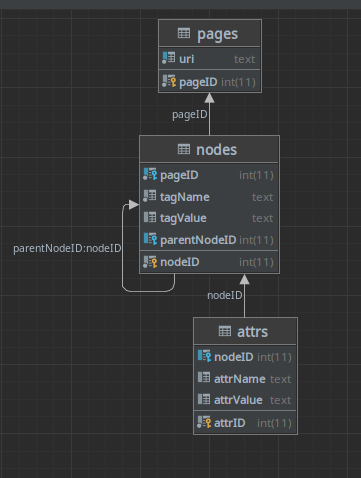

I was bored, so I've done this

The principle is to store a HTML file in a database, using the relational model
Theses database screens may help to understand :

The `store.py` script is used to store the HTML structure in the database (using BeautifulSoup)
The `index.php` script is used to retrieve a structure from the database, and generate an HTML file

Don't expect anything too serious, I made this for fun
